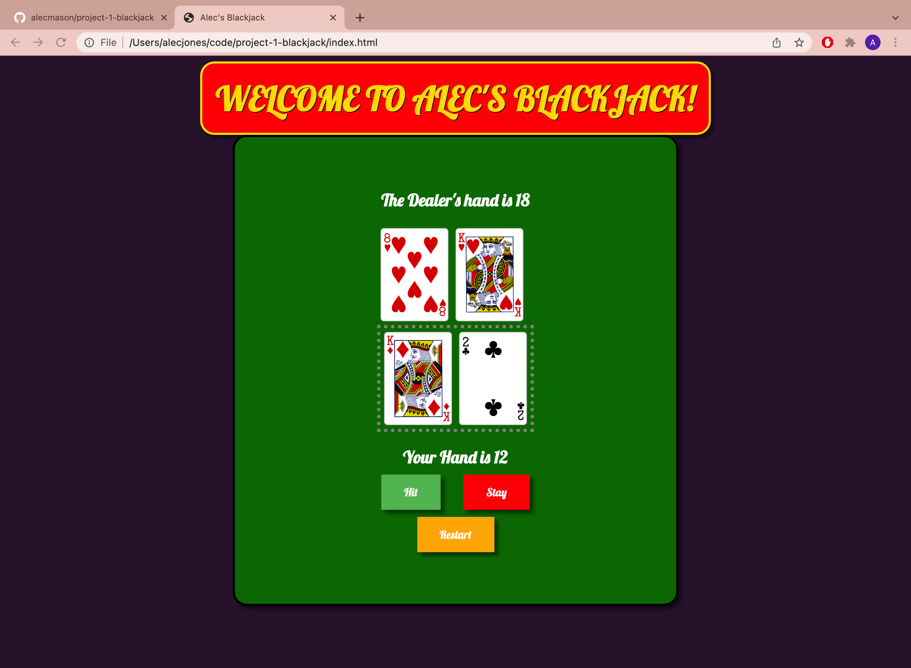
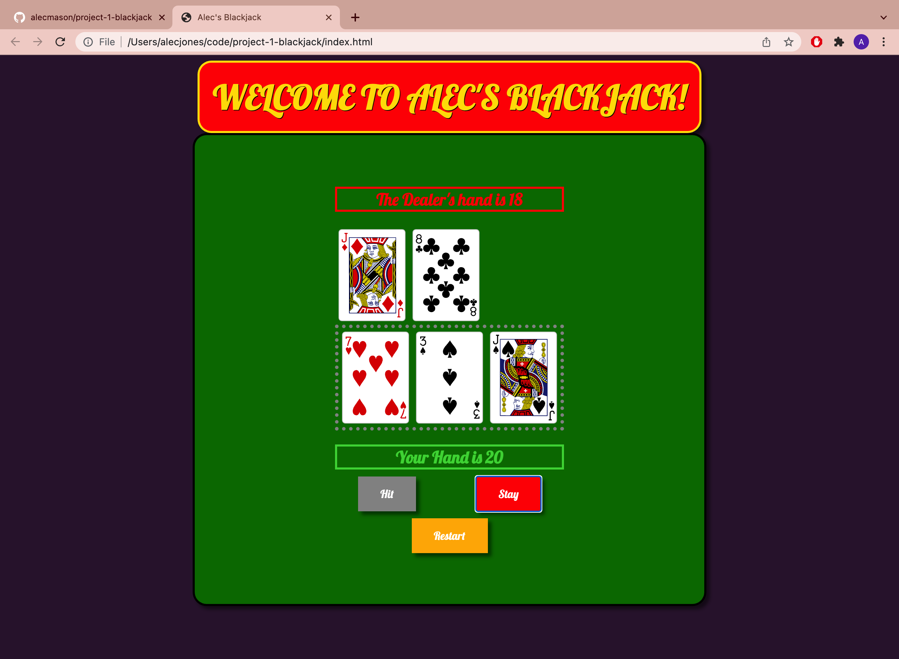
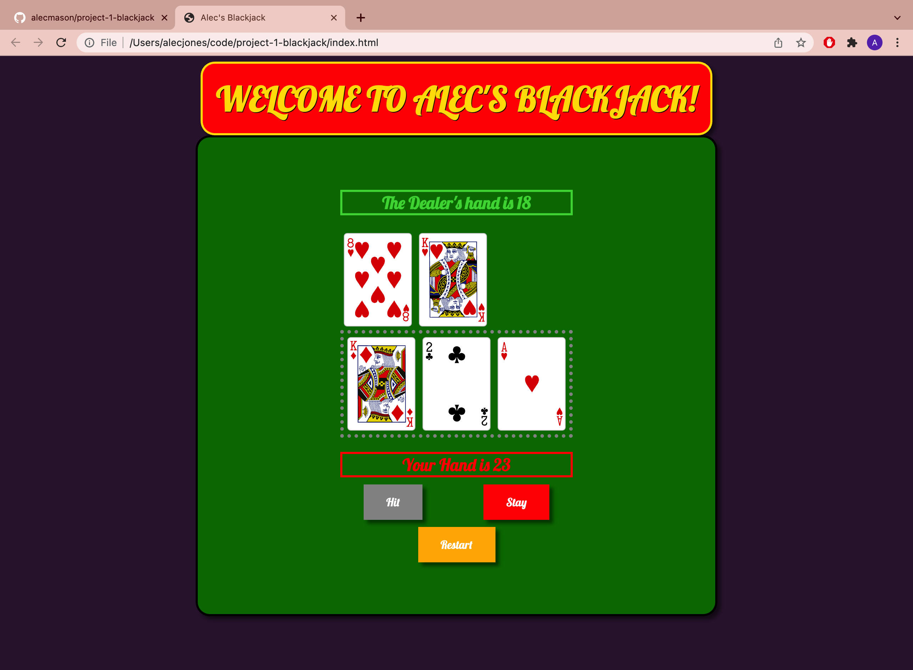

# Alec's Blackjack
project - 1 - blackjack

player here -> https://alecmason.github.io/project-1-blackjack/

## The game on startup

The game begins with the dealer and player already dealt their first hand.

    Use the HIT button to add another card but be careful not to bust!

    
    Use the STAY button to hold onto your cards and with luck you will beat the dealer's hand!

## The player wins

    After you've won (luckily) press the RESTART button to play a new round!
## The dealer wins

## icebox - future enhancements
1. "Money" to gamble and to keep score
2. individual user logins, a database of users, and global scoreboard
3. implement doubling down and additional blackjack plays
3. implement additional players 
4. let individual players decide if Ace is 1 or 11